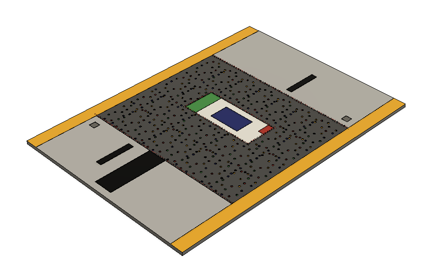
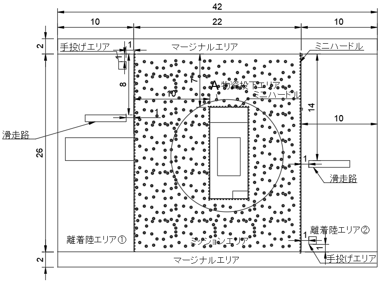
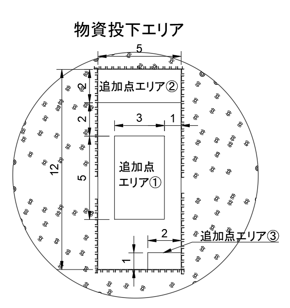
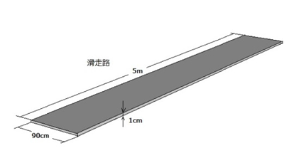
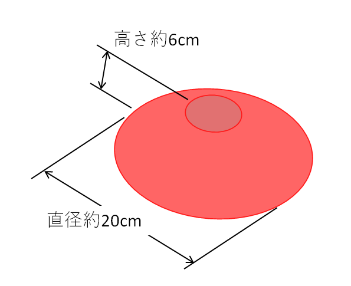
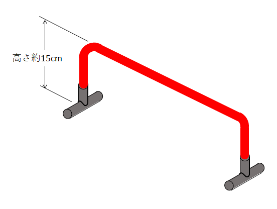
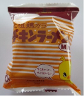
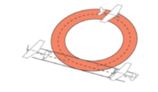



第20回　全日本学生室内飛行ロボットコンテスト

# ビギナー部門  機体レギュレーション 飛行競技ルール

発行日 2024/5/17  
Version 1.0

内容

1)出場機体・チーム構成・審査  
2)飛行競技エリア・離陸・機体回収  
3)飛行競技ルール（ビギナー部門）

赤文字は昨年度からの変更箇所を示す。

今後、修正点は本文に記したうえで、以下余白に追加する。

## 1)出場機体・チーム構成・審査  
   
### 1.プロペラ  
・回転翼・ダクトファンの総称。便宜上、本大会では、ヘリコプタ、オートジャイロのローターのように主として揚力の発生を目的としている回転翼も全て「プロペラ」と呼称する。プロペラの改造および作成を行った場合については十分な強度と安全性を確保した上で審査書類に明記し、機体審査において審判員に説明すること。

### 2.機体の設計、製作、部品  
・一般に市販されている飛行機・マルチコプターその他の完成品、キットの参加は許可しない。各チームで機体を企画し設計すること。  
   
### 3.飛行機タイプ  
・固定翼機、羽ばたき機、あるいはオートジャイロのように揚力を発生させるためのプロペラを動力駆動しない回転翼機。ヘリウムガスを使用する航空機タイプの機体は事務局が指示する方法で機体審査を行う。なお、ヘリウムガスによって空虚重量の50%以上の浮力を発生させている場合は飛行船タイプに分類される。  
   
### 4.飛行船タイプ  
・ヘリウムガスをつめた気嚢により機体を浮揚させる航空機のこと。飛行船は空虚重量の50%以上をヘリウムガスの浮力で支えるものとし、ヘリウムガスは参加チームが用意すること。  
   
### 5.マルチコプター  
 ・揚力を複数のプロペラ推力によってまかなう機体。

### 6.ハイブリッド機  
 ・揚力を固定翼・動力駆動するプロペラその他の装置の組み合わせによって得ており、かつ推進用のプロペラ等を備える機体。推力方向の変更によるVTOL機もハイブリッド機に含まれる。ハイブリッド機はすべての部門に参加登録できる。

### 7.空虚重量  
・機体の総重量のこと。ただし救援物資とともに投下される全ての投下補助器具の合計重量を含む。

・離陸重量（競技開始時の重量）から救援物資を除いた重量。自動操縦装置、マルチコプターに取り付けるカメラ、カメラ専用のバッテリー（及びその付属品と認められる部品）、動力用のバッテリー、救援物資を機体に取り付けるための補助具は空虚重量に含まれる。  
・救援物資を機体に取り付けるための補助具の重量は大会側で用意した救援物資の標準値との差分によって求める。競技で使用する補助具は全て機体審査に持参すること。  
   
### 8.救援物資  
・救援物資輸送ミッションで使用する物体。詳細は該当ミッションに記載する。これを機体に搭載するために付属物を用いることができるが、その付属物は救援物資より軽く、かつ投下した際に床を傷つける恐れのないものに限る。  
   
### 9.最大長  
・機体を水平面に投影した際、投影図上の2点を結ぶ線分のうち最長の長さ。  
   
### 10.コール  
・競技参加者が後述する指定のミッションの指定のタイミングで、レフェリーに対して指定される用語にて、自身の行動を宣言する行為。  
・コールは操縦者および補助者によって行われる。複数のコールがあった場合、レフェリーが聞き取れた最後のコールが有効となる。  
   
### 11.動力  
・動力として、電動モーター、バッテリーにて駆動したプロペラ、羽ばたき機構等を使用すること。オリジナル部品の使用は禁止しないが、安全性に十分配慮すること。  
   
### 12.バッテリー  
・バッテリーとして二次電池を使用する場合、種類は以下のものに限る。  
・ Li-Po 電池：最大2セル(最大電圧8.4V以下)  
・ Li-Fe 電池：最大2セル(最大電圧7.2V以下)

 ### 13.操縦装置(プロポ)  
・市販のラジコン送受信機を使用し、送受信部の改造は禁ずる。2.4GHz帯周波数を使用した送受信機で認証シールが貼られている物に限る。海外製の送受信機を使用する際はシールの有無(技適の有無)を確認すること。  
・フェイルセーフ機能として、送信機-受信機間の接続が切れた場合にスロットルパワーがオフになる機能を有し、その機能を使用すること  
   
### 14.チーム構成  
・飛行競技に参加できるチームメンバーは操縦者（1名）と補助者（4名以内）、計5名以内とする。操縦者は当日配布されるゼッケンを着用すること。

### 15.安全性  
・参加機体は以下6項目の安全性を満たすこと。  
1\) 緊急時に確実かつ速やかに動力を停止できること  
2\) 進行方向に突起物がある場合は、カバーを施すなどの安全処置を行うこと。  
3\) 混信や通信不良に備え、送信機-受信機間の接続が切れた場合にスロットルパワーがオフになるフェイルセーフ機能を設定すること  
4\) 飛行船タイプの場合、ヘリウムガスをつめた気嚢がそれ以外の構造物と分離して浮上し、天井等に引っ掛からないように安全対策が取ってあること  
5)審判によって飛行中止を求められた場合、速やかに飛行競技エリア内に着陸できること  
6)ハンズオフ飛行中においては、瞬時に操縦者による遠隔操縦に切り替えられること  
   
### 16.機体審査  
・機体の安全性を書類審査、飛行動画審査、当日機体審査にて審査員が確認する。  
・機体は本番機と同型予備機の最大2機による参加を認める。予備機の機体審査は本番機と同一の機体審査用紙で行うが、本番機と予備機に大きな機体形状の差異が認められる場合は審議の上予備機の登録が認められない場合がある。  
・機体審査円滑化のため、競技者による当日機体審査手続きを推奨する。  
・大会前に、参加予定の機体が飛行競技ルールに則り競技が行えることを、飛行動画にて審査する。参加チームは以下の要領に従って飛行動画を提出すること。  
1\) 参加機体の離着陸、左右の旋回を含み、操縦者によって機体が十分にコントロールされていることを証明できるものであること  
2\) 機体が地面を離れてから、接地するまでの飛行時間が1分以上のものであること  
3\) 飛行動画は大会事務局が指定する期日までに指定の方法で提出すること  
4\) 機体、部門によっては上記に加えて、さらに別動画の提出を求める場合がある  
5\) 安全上、主催者が操縦者の技量未熟、機体が競技に適さないと判断する場合には出場は許可されない

### 17.点数の確定  
・点数は飛行競技直後のアナウンスにて確定される。その後の点数の修正は行わない。  
・動画その他の媒体を用いた事後判定は行わない。  
・飛行競技中の審判および得点集計のミス等が明らかな場合、該当チームに対し再飛行の提案を行う場合がある。ただし、再飛行を行った場合には、再飛行時の点数が採用される。

### 18.その他  
・大会の進行を妨げる場合、また大会の名誉及び品位を著しく損なうような行為及び言動を示す場合、該当チームへの処分を行う。  

## 2)飛行競技エリア・離陸・機体回収     
### 1.飛行競技エリア・飛行可能領域  
・飛行競技エリアは「離着陸エリア①」「離着陸エリア②」(前2つを合わせて「離着陸エリア」と呼ぶ)「ミッションエリア」「物資投下エリア」「マージナルエリア」からなる。また、「離着陸エリア①」「離着陸エリア②」「マージナルエリア」を「立入可能エリア」とし、補助員が立入り可能なエリアとする。操縦者は「離着陸エリア①」のみ立入り可能とする。機体が飛行可能な空域は飛行競技エリアおよびその上空に限る。  
・ミッションエリアには図に示すマーカーコーンが約1m毎に設置される。  
・ミッションエリアと立ち入り可能エリアの境界および、ミッションエリアと物資投下エリアの境界には、図に示すミニハードルが設置される。ただし、滑走路の延長線上にはミニハードルは設置されない。  
・機体が静止している状態においてのみ、補助員はミッションエリア・物資投下エリアに進入できる。このとき、競技中に投下した物資に触れてはならない。(審判の手によって元の位置に戻される)  
・ビギナー部門においては、フィールド内に滑走路が設置される。  
・滑走路の大きさは約5.5m×0.9mとし、高さは10mmとする。滑走路は塗装された木材で作成される。  
・滑走路を踏むことは禁止とし、レフェリーにより警告が与えられる。  
・会場の都合で競技フィールドの広さ等（寸法）が多少変更になる場合があるが、基本的なレイアウトは変更しない。  
・会場の床シートの目張りについては会場との調整の結果を追って告知する。

図　ビギナー部門のフィールド

  
図　滑走路（※実際の滑走路長は約5.5m）

  
図　マーカーコーン

   
図　ミニハードル  

### 2.離陸  
・「離陸」という語句の定義はすべてこの項の記述に従う。  
・離陸は自力滑走による離陸、あるいはカタパルト等の補助具を用いた離陸、手投げ発進のどちらでもよい。ただし補助具は滑走路上に設置すること。マルチコプターの手投げ発進は認めない。  
・手投げは指定の手投げエリアから発進すること。  
・最初の離陸が滑走路内で成功した場合、離陸点として300点が加算される。手投げ発進の場合、離陸点は加点されない。  
・機体が転倒するなどして離陸を完了できない場合は、機体回収を行い、再度  
　機体を離陸させる。  
   
### 3.機体回収  
・「機体回収」という語句の定義はすべてこの項の記述に従う。  
・機体回収はプロペラ(に準ずる推進装置)が停止し機体が静止した状態で行う。  
・機体が静止した状態に限り、補助員はミッションエリア・物資投下エリアに進入できる。操縦者の立ち入りはできない。このとき補助員においてはこの2エリアを立ち入り可能エリアと同等のものとみなす。  
・機体回収が成功した場合、離着陸エリア①もしくは離着陸エリア②の滑走路もしくは手投げエリアから離陸してよい。  
   
### 4.操縦  
・操縦者の遠隔操縦にて操縦する。  
・飛行中、操縦者は離着陸エリア①内を移動してよい。  
・補助者は立入可能エリアから操縦者に指示を送ることができる。それ以外の場所および人から操縦者へ指示を送ることは認めない。

### 5.ハンズオフ飛行（ビギナー部門）  
・機体が操縦者の遠隔操縦を受けずに飛行を行っている状態  
・ハンズオフ飛行中の操縦者は送信機のスティックから指を離すこととし、操縦をしてはならない。ただし送信機から手を離してはならない。  
・ハンズオフ飛行中であることを、機体に取り付けられた発光体(LEDなど)の変化で示すこと(審判から目視判断できること)  
・機体の誘導、自己位置推定を補助する自走しない器具(マーカー)を設置することができる。補助員、もしくは操縦者が保持した状態で誘導、自己位置推定に利用することはできない。  
・マーカーはポールを含めてどこに何個設置しても良い。飛行競技エリア外の場　合は事前に事務局に相談すること。  
・ビギナー部門では競技中のマーカーの修理は認めない。

### 6.再飛行・修理  
・ビギナー部門においては、競技中の修理は認めない。  
・競技中のバッテリーの交換は禁止する。搭載されているバッテリーの切断、再投入は安全に留意すること。

### 7.飛行中止・警告・失格  
・以下の場合、飛行は直ちに中止され、未帰還扱いとする。中止までに完了したミッションの得点は加算される。  
1)最大総飛行時間内に離着陸エリアに戻ることができない場合  
2)機体に重大な損傷を受け、飛行競技が困難と判断された場合  
・以下の場合、警告を与える。警告3回をうけたチームは直ちに飛行を中止し、未帰還扱いとする。  
1)参加者や設備等に危険を及ぼす可能性がある飛行とレフェリーが判断した場合(マージナルエリアを含む飛行競技エリアを逸脱して飛行する等)  
2)競技者が指定されたエリアから出た場合（滑走路内に立ち入る、滑走路を踏む、操縦者もしくは補助者がミッションエリアに進入する等）  
3)競技中に操縦者および補助者以外の者から補助や指示を受けた場合  
4)審判と接触もしくは審判を妨害する行為。このとき当該ミッションを失敗と判断する場合がある。  
・以下の場合、飛行競技中に関わらず（練習飛行、ピット作業等）直ちに失格となる。  
　1)競技フィールドや設備、備品を損傷する、または損傷しようとする行為。  
　2)レフェリーの警告や指示に従わない場合。

### 8.その他  
・競技チームは飛行開始前に舵の動き等を確認し、準備完了を審判に伝えること。  
・会場では空調が稼働している。  
・機体を飛行させる時、目の怪我を防ぐため、操縦者及び補助者は必ずゴーグル（眼鏡も可）を持参し着用すること。  
・チームメンバーは大会主催者と協力し、運営スタッフ、参加者、観客など大会にかかわるすべての人の安全を確保しなければならない。  
・参加チームは設計者として、自らが製作した機体の安全性について責任を負うこと。  
・本ルールに記載されていない行為、フェアプレー精神に反する行為については、レフェリーの決定に委ねられる。

## 3)飛行競技ルール（ビギナー部門）  
   
### 1.競技内容の概要  
・参加機体は、離発着エリアから飛行を開始し、ミッションエリアにて以下に述べるミッションを完了したのち、離発着エリアに帰還する。  
・最大飛行時間内に複数のミッションを行い、機体の性能および操縦性を評価する項目の総合点を競う。  
・飛行機タイプ、ハイブリッド機タイプ、飛行船タイプの参加を許可する。  
   
### 2.参加機体  
・飛行競技に参加可能な機体は、機体レギュレーションに準拠し、かつ機体審査を通過した機体に限る。  
・ビギナー部門に参加できる機体は各タイプについて、以下の条件を満たす機体に限る。  
#### 1\) 飛行機タイプ・ハイブリッドタイプ  
　空虚重量が250g以下であること

#### 2\) 飛行船タイプ  
　最大長が1.7m 以下であること  
　空虚重量の制限は原則無し、明らかに過大な場合は不可とする  
　  
### 3.ミッションの種類  
・メインミッションは競技開始時に開始され、終了しなければ他のミッションには挑戦できない。メインミッションの開始コールの必要はない。  
・サブミッションは、「救援物資運搬」「軽量構造」を除いて、各サブミッションに挑戦中に他のミッションに挑戦できない。すなわち成功条件・もしくは失敗条件を満たした場合にのみ、次のミッションに挑戦できる。サブミッションは「軽量構造」「救援物資運搬」「ハンズオフ飛行」「宙返り」「水平旋回」とする。  
・「救援物資運搬」の得点は競技終了時の救援物資の投下状況によって計算される。  
   
### 4.ビギナー部門におけるミッション  
・ビギナー部門は決勝のみ実施される。  
・ビギナー部門においてはメインミッションのギブアップを許可する。「メインミッション中断」のコールを行うことでメインミッションを終了し、その後サブミッションに挑戦できる。  
 

### 5.競技開始  
・競技は離着陸エリア①の滑走路上に機体を静止させた状態で開始する。手投げ発進の場合は離着陸エリア①の手投げエリアにてスタンバイした状態で開始する。  
   
### 6.ミッションの申告  
・各チームは飛行競技開始前に、実施するミッションをミッション記入用紙に記入すること。また、それぞれのミッションを実施する直前にも、確認のため再度レフェリーにコールすること。飛行時間との兼ね合いで、ミッションを省略する場合もコールすること。飛行競技中に順序を入れ替えても良い。  
   
### 7.各ミッションへの再挑戦  
・コールしたミッションに失敗した場合、同ミッションについてのみ再挑戦を許可する。

### 8.救援物資  
・救援物資は、日清食品の「チキンラーメンmini」とする。  
  
図　チキンラーメンmini

・救援物資は当日参加者が準備し、搭載のために救援物資補助具などを取り付けても良いが、袋の気密性を害する加工を行ってはならない。気密性が損なわれていると判断される場合、救援物資の交換を指示する。

### 9.メインミッション  
#### 	成功条件  
・ミッションエリア（物資投下エリアを含む）に救援物資を1つ投下する こと  
#### 	失敗条件  
		・持ち込んだ救援物資をミッションエリア（物資投下エリアを含む）外にすべて投下すること  
		・「メインミッション中断」のコールがされること  
#### 付記  
		・救援物資は競技開始前に機体に2つまで搭載できる。  
		・競技開始後の救援物資の機体への搭載は認めない。

### 10.軽量構造  
#### 	成功条件  
		・機体審査において200g以下の空虚重量が計測されたうえで、メインミッションと帰還を達成すること  
#### 	失敗条件  
		・メインミッションもしくは帰還に失敗すること。  
#### 	点数  
・「軽量構造点」 \= 300点  
#### 付記  
		・このミッションにコールは必要ない。

### 11.救援物資運搬  
#### 	成功条件  
・物資投下エリアに1つ以上救援物資を投下すること  
#### 	失敗条件  
		・持ち込んだ救援物資を物資投下エリア外にすべて投下すること  
#### 	点数  
・追加点は以下のように定義する。  
		物資投下エリア：100点×個数  
		追加点エリア①：150点×個数  
		追加点エリア②：200点×個数  
		追加点エリア③：400点×個数  
		追加点エリア②、③にそれぞれ１個の投下が成功した場合、個別の追加点　　に加えて「物資運搬追加点」300点を加点する。

#### ミッションのプロセス  
		1\) 競技開始前に機体に救援物資を2個まで搭載する。  
		2\) 競技開始とともに、離着陸エリア①の滑走路から離陸した後、競技エリアに救援物資を投下する。  
#### 付記  
		・本ミッションの開始コールの必要はない。  
		・本ミッションにおける点数は、競技終了時の救援物資の投下状況によって決定される。

### 12.宙返り  
#### 	成功条件  
		・軌道面が地面に対して十分に垂直な宙返りを行うこと  
#### 	失敗条件  
		・次のミッションがコールされること  
#### 	点数  
・上下方向に機体が1回転して宙返り開始地点に戻ってきたら1回転成功したとみなし、宙返り回数に応じて加点される。  
・「宙返り点」= 宙返り回数×100  
#### 付記  
		・連続しての宙返り（各宙返りの間に１秒以上の水平飛行が行われない）は認めない。  
		・宙返り回数の上限は3回とする。

### 13.手放し飛行  
#### 	成功条件  
		・ハンズオフ飛行による飛行を3秒間継続すること。  
#### 	失敗条件  
		・次のミッションがコールされること  
#### 	点数  
		「ハンズオフ飛行点」＝ 200点  
ハンズオフ飛行を行っている際、動力による推進無しの状態を維持できた場合、加点する。  
		「ハンズオフ飛行追加点」 \= 100点  
#### 	付記  
		飛行船タイプも本ミッションには挑戦できる。

### 14.水平旋回  
#### 	成功条件  
・ハンズオフ飛行による水平旋回を行うこと  
#### 	失敗条件  
		・次のミッションがコールされること  
#### 	点数  
・「水平旋回点」= 水平旋回回数×200 \+ 水平旋回追加点  
・高度変化の十分小さい1周の旋回の回数を水平旋回回数とする。最大水平旋回回数は2回とする。  
・水平旋回追加点は連続して2回旋回できた場合に加点される  
・水平旋回追加点 \= 200点  
#### 	付記  
		・飛行船の超信地旋回（旋回の中心軸が機体の内側となる）は認めない。  

### 15.帰還  
・ミッションを完了した機体は「帰還」を行うことができ、「帰還」によって飛行競技終了となる。  
・帰還する際には「帰還」のコールをすること。  
・ミッションエリアから離着陸エリア①に接地して機体が完全に静止した時点で帰還したとみなす｡  
・離着陸エリア①の滑走路面以外に接触せず、着陸静止できた場合は「着陸点」として300点が与えられる｡  
・機体の着陸判定については、「全搭載物のうち、接地している物の場所」を基準とする。  
・最大総飛行時間内に離着陸エリア①に戻ることができない場合は「未帰還」とする｡  
   
### 16.飛行時間・時間点  
・飛行開始の合図と共に計測を開始し、帰還し完全に静止した時点で計測を終了する。計測できた時間を「総飛行時間」とする。計時は1秒未満を切り捨てる。  
・「帰還」した機体については、以下の計算式により計算される。「時間点」が加算される上限は300点とする。  
「時間点」=（標準飛行時間−総飛行時間）×5  
（標準時間よりも総飛行時間が長い場合には「時間点」は負となる。）  
・ビギナー部門の「標準飛行時間」は2分、最大総飛行時間は3分とする。

   
### 17.順位決定  
・まず、メインミッションおよび帰還の成否により以下の区分に分ける。  
優先1) メインミッションに成功し、帰還に成功したチーム  
優先2) メインミッションに失敗し、帰還に成功したチーム  
優先3) メインミッションに成功し、帰還に失敗したチーム  
優先4) メインミッションに失敗し、帰還に失敗したチーム  
・優先度が高い順、同じ優先度内で高得点順に順位を決定する。

   
 

