

第20回　全日本学生室内飛行ロボットコンテスト

# 機体レギュレーション 飛行競技ルール

発行日 2024/5/17  
Version 1.0

内容
## 目次
1)共通ルール：出場機体・チーム構成・審査  
2)共通ルール：飛行競技エリア・離陸・機体回収  
3)飛行競技ルール（一般部門）  
4)飛行競技ルール（自動操縦部門）  
5)飛行競技ルール（ユニークデザイン部門）  
6)飛行競技ルール（マルチコプター部門）

赤文字は昨年度からの変更箇所を示す。

今後、修正点は本文に記したうえで、以下余白に追加する。

## 1)共通ルール：出場機体・チーム構成・審査  
### 1.プロペラ  
・回転翼・ダクトファンの総称。便宜上、本大会では、ヘリコプタ、オートジャイロのローターのように主として揚力の発生を目的としている回転翼も全て「プロペラ」と呼称する。プロペラの改造および作成を行った場合については十分な強度と安全性を確保した上で審査書類に明記し、機体審査において審判員に説明すること。

### 2.機体の設計、製作、部品  
・一般に市販されている飛行機・マルチコプターその他の完成品、キットの参加は許可しない。各チームで機体を企画し設計すること。  
   
### 2.飛行機タイプ  
・固定翼機、羽ばたき機、あるいはオートジャイロのように揚力を発生させるためのプロペラを動力駆動しない回転翼機。ヘリウムガスを使用する航空機タイプの機体は事務局が指示する方法で機体審査を行う。なお、ヘリウムガスによって空虚重量の50%以上の浮力を発生させている場合は飛行船タイプに分類される。  
   
### 3.飛行船タイプ  
・ヘリウムガスをつめた気嚢により機体を浮揚させる航空機のこと。飛行船は空虚重量の50%以上をヘリウムガスの浮力で支えるものとし、ヘリウムガスは参加チームが用意すること。  
   
### 4.マルチコプター  
 ・揚力を複数のプロペラ推力によってまかなう機体。

### 5.ハイブリッド機  
 ・揚力を固定翼・動力駆動するプロペラその他の装置の組み合わせによって得ており、かつ推進用のプロペラ等を備える機体。推力方向の変更によるVTOL機もハイブリッド機に含まれる。ハイブリッド機はすべての部門に参加登録できる。

### 6.独立した制御ユニット  
・機体装備品のうち、単独モジュールとして機体から取り外すことができる装備は、下記の条件を満たすことで「独立した制御ユニット」として扱われる。  
1）独立した制御ユニットを内包できる直方体の3辺の合計が25cm以下である  
2）バッテリーおよび電動モーターを含まない  
ただしセンサーの稼働等、飛行に直接影響のない電動モーターは審査の上認められる  
3）独立した制御ユニットを取り外した場合であっても、機体構造が大きく変化せず、機体側に操縦用受信機が搭載されている  
・「独立した制御ユニット」は空虚重量に含まれない。

### 7.空虚重量  
・機体の総重量のこと。ただし救援物資とともに投下される全ての投下補助器具の合計重量を含む。  
・「独立した制御ユニット」を搭載した機体の場合、「独立した制御ユニット」の重量は空虚重量から除外される。  
・離陸重量（競技開始時の重量）から救援物資を除いた重量。自動操縦装置、マルチコプターに取り付けるカメラ、カメラ専用のバッテリー（及びその付属品と認められる部品）、動力用のバッテリー、救援物資を機体に取り付けるための補助具は空虚重量に含まれる。  
・救援物資を機体に取り付けるための補助具の重量は大会側で用意した救援物資の標準値との差分によって求める。競技で使用する補助具は全て機体審査に持参すること。  
   
### 8.救援物資  
・救援物資輸送ミッションで使用する物体。詳細は該当ミッションに記載する。これを機体に搭載するために付属物を用いることができるが、その付属物は救援物資より軽く、かつ投下した際に床を傷つける恐れのないものに限る。  
   
### 9.最大長  
・機体を水平面に投影した際、投影図上の2点を結ぶ線分のうち最長の長さ。  
   
### 10.コール  
・競技参加者が後述する指定のミッションの指定のタイミングで、レフェリーに対して指定される用語にて、自身の行動を宣言する行為。  
・コールは操縦者および補助者によって行われる。複数のコールがあった場合、レフェリーが聞き取れた最後のコールが有効となる。  
   
### 11.動力  
・動力として、電動モーター、バッテリーにて駆動したプロペラ、羽ばたき機構等を使用すること。オリジナル部品の使用は禁止しないが、安全性に十分配慮すること。  
   
### 12.バッテリー  
・バッテリーとして二次電池を使用する場合、種類は以下のものに限る。  
・ Li-Po 電池：最大2セル(最大電圧8.4V以下)  
・ Li-Fe 電池：最大2セル(最大電圧7.2V以下)  
・ただしマルチコプター部門において一定条件を満たす場合、Li-Po 電池：3セル(最大電圧12.6V以下)の使用を認める。  
   
### 13.操縦装置(プロポ)  
・市販のラジコン送受信機を使用し、送受信部の改造は禁ずる。2.4GHz帯周波数を使用した送受信機で認証シールが貼られている物に限る。海外製の送受信機を使用する際はシールの有無(技適の有無)を確認すること。  
・フェイルセーフ機能として、送信機-受信機間の接続が切れた場合にスロットルパワーがオフになる機能を有し、その機能を使用すること  
   
### 14.チーム構成  
・飛行競技に参加できるチームメンバーは操縦者（1名）と補助者（4名以内）、計5名以内とする。操縦者は当日配布されるゼッケンを着用すること。

### 15.安全性  
・参加機体は以下6項目の安全性を満たすこと。  
1\) 緊急時に確実かつ速やかに動力を停止できること  
2\) 進行方向に突起物がある場合は、カバーを施すなどの安全処置を行うこと。  
3\) 混信や通信不良に備え、送信機-受信機間の接続が切れた場合にスロットルパワーがオフになるフェイルセーフ機能を設定すること  
4\) 飛行船タイプの場合、ヘリウムガスをつめた気嚢がそれ以外の構造物と分離して浮上し、天井等に引っ掛からないように安全対策が取ってあること  
5)審判によって飛行中止を求められた場合、速やかに飛行競技エリア内に着陸できること  
6)ハンズオフ飛行中においては、瞬時に操縦者による遠隔操縦に切り替えられること  
   
### 16.機体審査  
・機体の安全性を書類審査、飛行動画審査、当日機体審査にて審査員が確認する。  
・機体は本番機と同型予備機の最大2機による参加を認める。予備機の機体審査は本番機と同一の機体審査用紙で行うが、本番機と予備機に大きな機体形状の差異が認められる場合は審議の上予備機の登録が認められない場合がある。  
・機体審査円滑化のため、競技者による当日機体審査手続きを推奨する。  
・大会前に、参加予定の機体が飛行競技ルールに則り競技が行えることを、飛行動画にて審査する。参加チームは以下の要領に従って飛行動画を提出すること。  
1\) 参加機体の離着陸、左右の旋回を含み、操縦者によって機体が十分にコントロールされていることを証明できるものであること  
2\) 機体が地面を離れてから、接地するまでの飛行時間が1分以上のものであること  
3\) 飛行動画は大会事務局が指定する期日までに指定の方法で提出すること  
4\) 機体、部門によっては上記に加えて、さらに別動画の提出を求める場合がある  
5\) 安全上、主催者が操縦者の技量未熟、機体が競技に適さないと判断する場合には出場は許可されない

### 17.点数の確定  
・点数は飛行競技直後のアナウンスにて確定される。その後の点数の修正は行わない。  
・動画その他の媒体を用いた事後判定は行わない。  
・飛行競技中の審判および得点集計のミス等が明らかな場合、該当チームに対し再飛行の提案を行う場合がある。ただし、再飛行を行った場合には、再飛行時の点数が採用される。

### 18.その他  
・大会の進行を妨げる場合、また大会の名誉及び品位を著しく損なうような行為及び言動を示す場合、該当チームへの処分を行う。  
    
## 2)共通ルール：飛行競技エリア・離陸・機体回収  
### 1.飛行競技エリア・飛行可能領域  
・飛行競技エリアは「離着陸エリア①」「離着陸エリア②」(前2つを合わせて「離着陸エリア」と呼ぶ)「ミッションエリア」「物資投下エリア」「マージナルエリア」からなる。また、「離着陸エリア①」「離着陸エリア②」「マージナルエリア」を「立入可能エリア」とし、補助員が立入り可能なエリアとする。操縦者は「離着陸エリア①」のみ立入り可能とする。機体が飛行可能な空域は飛行競技エリアおよびその上空に限る。  
・ミッションエリアには図に示すマーカーコーンが約1m毎に設置される。  
・ミッションエリアと立ち入り可能エリアの境界および、ミッションエリアと物資投下エリアの境界には、図に示すミニハードルが設置される。ただし、滑走路の延長線上にはミニハードルは設置されない。  
・機体が静止している状態においてのみ、補助員はミッションエリア・物資投下エリアに進入できる。このとき、競技中に投下した物資に触れてはならない。(審判の手によって元の位置に戻される)  
・一般・自動操縦部門において、ポール旋回・飛行高度確認用のポールを図に示す位置に2本設置する。ポールの高さは3メートルとし、2本間の最上部には高度確認用のヒモが渡される。  
・一般部門・自動操縦部門・ユニークデザイン部門においては、フィールド内に滑走路が設置される。マルチコプター部門においては、フィールド内にバーティポートが設置される。  
・滑走路の大きさは約5.5m×0.9mとし、高さは10mmとする。滑走路は塗装された木材で作成される。  
・滑走路・バーティポートを踏むことは禁止とし、レフェリーにより警告が与えられる。  
・会場の都合で競技フィールドの広さ等（寸法）が多少変更になる場合があるが、基本的なレイアウトは変更しない。  
・バーティポートの大きさは1.5m×1.5mとし、高さは設けない。バーティポートは緑色のフェルト材にて作成される。  
・会場の床シートの目張りについては会場との調整の結果を追って告知する。

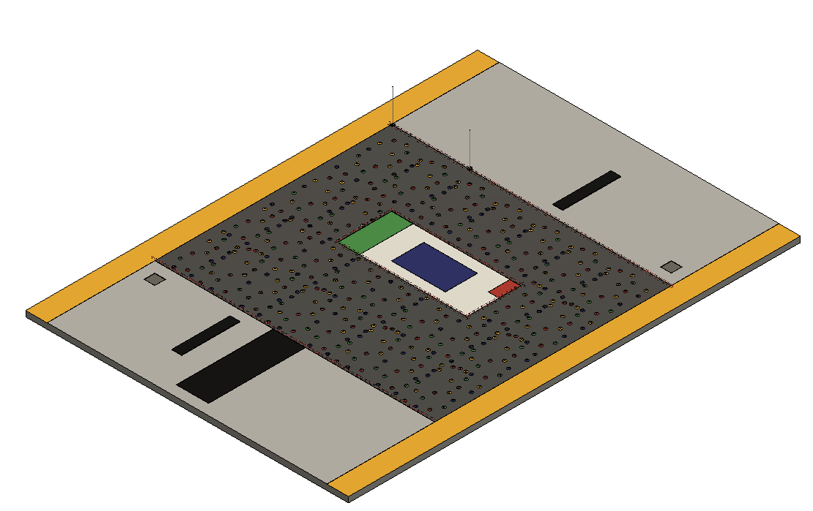

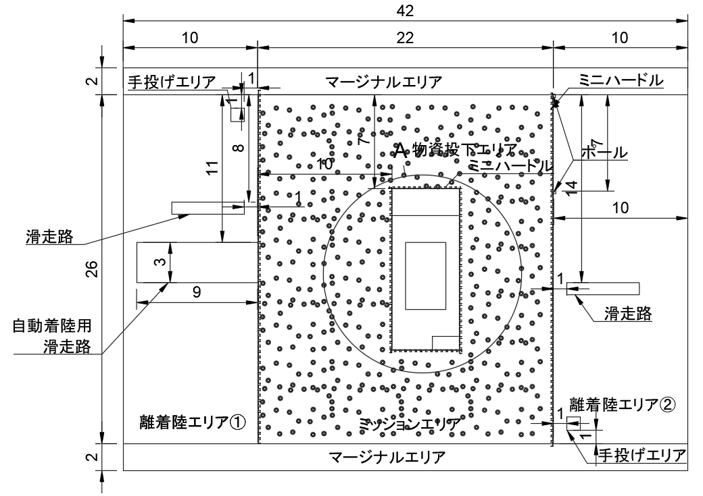

図　一般部門・自動操縦部門・ユニークデザイン部門のフィールド

  
図　滑走路（※実際の滑走路長は約5.5m）

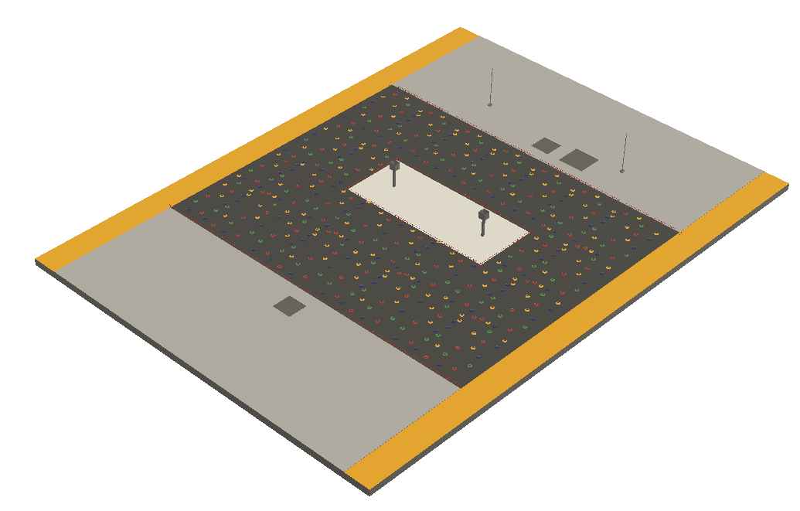  
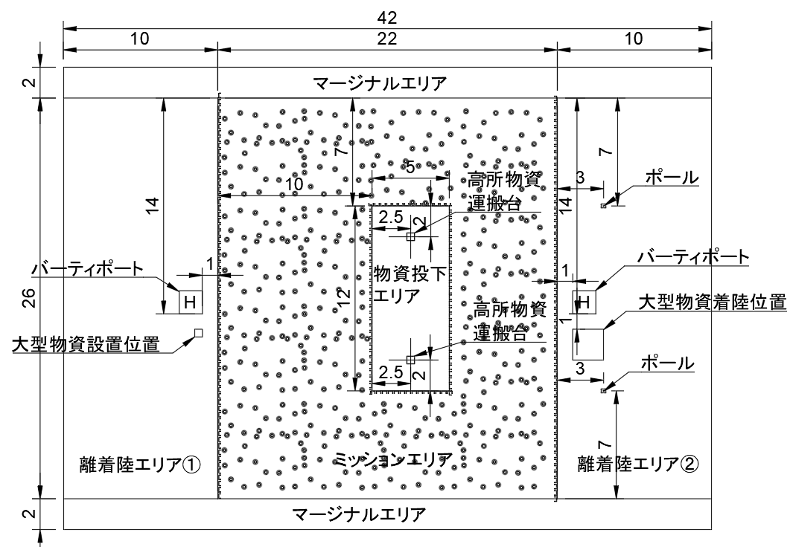  
図　マルチコプター部門のフィールド

  
図　マーカーコーン

   
図　ミニハードル  
### 2.離陸  
・「離陸」という語句の定義はすべてこの項の記述に従う。ただし、一般部門におけるサブミッション「投下救援物資回収」の「離陸」はこの限りではない。  
・離陸は自力滑走による離陸、あるいはカタパルト等の補助具を用いた離陸、手投げ発進のどちらでもよい。ただし補助具は滑走路上・バーティポート内に設置すること。マルチコプターの手投げ発進は認めない。  
・手投げは指定の手投げエリアから発進すること。  
・最初の離陸が滑走路内・バーティポート内で成功した場合、離陸点として300点が加算される。手投げ発進の場合、離陸点は加点されない。  
・機体が転倒するなどして離陸を完了できない場合は、機体回収を行い、再度  
　機体を離陸させる。  
   
### 3.機体回収  
・「機体回収」という語句の定義はすべてこの項の記述に従う。  
・機体回収はプロペラ(に準ずる推進装置)が停止し機体が静止した状態で行う。  
・機体が静止した状態に限り、補助員はミッションエリア・物資投下エリアに進入できる。操縦者の立ち入りはできない。このとき補助員においてはこの2エリアを立ち入り可能エリアと同等のものとみなす。  
・機体回収が成功した場合、離着陸エリア①もしくは離着陸エリア②の滑走路もしくは手投げエリアから離陸してよい。  
   
### 4.操縦  
・操縦者の遠隔操縦にて操縦する。  
・飛行中、操縦者は離着陸エリア①内を移動してよい。  
・補助者は立入可能エリアから操縦者に指示を送ることができる。それ以外の場所および人から操縦者へ指示を送ることは認めない。

### 5.ハンズオフ飛行  
・機体が操縦者の遠隔操縦を受けず、自動飛行装置を用いて自律制御飛行を行っている状態  
・ハンズオフ飛行中の操縦者は送信機のスティックから指を離すこととし、操縦をしてはならない。ただし送信機から手を離してはならない。  
・ハンズオフ飛行中であることを、機体に取り付けられた発光体(LEDなど)の変化で示すこと(審判から目視判断できること)  
・機体の誘導、自己位置推定を補助する自走しない器具(マーカー)を設置することができる。補助員、もしくは操縦者が保持した状態で誘導、自己位置推定に利用することはできない。  
・マーカーはポールを含めてどこに何個設置しても良い。飛行競技エリア外の場　合は事前に事務局に相談すること。  
・機体が離着陸エリア内で完全停止している場合に限り、競技中のマーカーの修理を認める。

### 6.再飛行・修理  
・機体が完全静止した場合、「機体回収」に従って機体を回収し、「離陸」項に従って離陸することを認める。  
・30秒以内で修理可能な軽微な破損に対しては離着陸エリア①内での修理を認める。修理を開始した時点から30秒以内で修理を完了させること。30秒を過ぎて修理が完了できない場合、その時点で飛行競技終了となり未帰還扱いとする。  
・修理に際しては、持ち込んだ道具を使用しても良い。接着剤等を使用する場合は汚れてもよいシートを各自用意しその上でのみ作業すること。  
・競技中のバッテリーの交換は禁止する。搭載されているバッテリーの切断、再投入は安全に留意すること。

### 7.飛行中止・警告・失格  
・以下の場合、飛行は直ちに中止され、未帰還扱いとする。中止までに完了したミッションの得点は加算される。  
1)最大総飛行時間内に離着陸エリアに戻ることができない場合  
2)機体に重大な損傷を受け、飛行競技が困難と判断された場合  
・以下の場合、警告を与える。警告3回をうけたチームは直ちに飛行を中止し、未帰還扱いとする。  
1)参加者や設備等に危険を及ぼす可能性がある飛行とレフェリーが判断した場合(マージナルエリアを含む飛行競技エリアを逸脱して飛行する等)  
2)競技者が指定されたエリアから出た場合（滑走路内に立ち入る、滑走路を踏む、操縦者もしくは補助者がミッションエリアに進入する等）  
3)競技中に操縦者および補助者以外の者から補助や指示を受けた場合  
4)審判と接触もしくは審判を妨害する行為。このとき当該ミッションを失敗と判断する場合がある。  
・以下の場合、飛行競技中に関わらず(練習飛行、ピット作業等)直ちに失格となる。  
　1)競技フィールドや設備、備品を損傷する、または損傷しようとする行為。  
　2)レフェリーの警告や指示に従わない場合。

### 8.その他  
・競技チームは飛行開始前に舵の動き等を確認し、準備完了を審判に伝えること。  
・会場では空調が稼働している。  
・機体を飛行させる時、目の怪我を防ぐため、操縦者及び補助者は必ずゴーグル（眼鏡も可）を持参し着用すること。  
・チームメンバーは大会主催者と協力し、運営スタッフ、参加者、観客など大会にかかわるすべての人の安全を確保しなければならない。  
・参加チームは設計者として、自らが製作した機体の安全性について責任を負うこと。  
・本ルールに記載されていない行為、フェアプレー精神に反する行為については、レフェリーの決定に委ねられる。

## 3)飛行競技ルール（一般部門）  
   
### 1.競技内容の概要  
・参加機体は、離発着エリアから飛行を開始し、ミッションエリアにて以下に述べるミッションを完了したのち、離発着エリアに帰還する。  
・最大飛行時間内に複数のミッションを行い、機体の性能および操縦性を評価する項目の総合点を競う。  
・飛行機タイプ、ハイブリッド機タイプ、飛行船タイプの参加を許可する。  
・参加チーム数が多い場合には予選を行う。予選は競技時間を限定する。  
   
### 2.参加機体  
・飛行競技に参加可能な機体は、機体レギュレーションに準拠し、かつ機体審査を通過した機体に限る。  
・一般部門に参加できる機体は各タイプについて、以下の条件を満たす機体に限る。  
#### 1\) 飛行機タイプ・ハイブリッドタイプ  
　空虚重量が200g以下であること  
　ただし「独立した制御ユニット」が搭載されている機体は、「独立した制御ユニット」の重量を除いた空虚重量が175g以下とする

#### 2\) 飛行船タイプ  
　最大長が1.7m 以下であること  
　空虚重量の制限は原則無し、明らかに過大な場合は不可とする  
　  
### 3.ミッションの種類  
・メインミッションは競技開始時に開始され、終了しなければ他のミッションには挑戦できない。メインミッションの開始コールの必要はない。  
・サブミッションは、各サブミッションに挑戦中に他のミッションに挑戦できない。すなわち成功条件・もしくは失敗条件を満たした場合にのみ、次のミッションに挑戦できる。サブミッションは「宙返り」「ポール旋回」「無動力滑空」「投下救援物資回収」「高所物資回収」とする。  
・「救援物資運搬」は成功条件を満たせば加点される。すなわち、メインミッション終了後、いくつかのサブミッションに挑戦してから着陸してもよい。  
・「救援物資運搬」の終了後に投下された救援物資は、審判によって即座に排除される。  
   
### 4.予選と決勝におけるミッション  
・予選および決勝において、全てのミッションへの挑戦を許可する。  
・予選においてはメインミッションのギブアップを許可する。「メインミッション中断」のコールを行うことでメインミッションを終了し、その後サブミッションに挑戦できる。  
   
### 5.競技開始  
・競技は離着陸エリア①の滑走路上に機体を静止させた状態で開始する。手投げ発進の場合は離着陸エリア①の手投げエリアにてスタンバイした状態で開始する。  
   
### 6.ミッションの申告  
・各チームは飛行競技開始前に、実施するミッションをミッション記入用紙に記入すること。また、それぞれのミッションを実施する直前にも、確認のため再度レフェリーにコールすること。飛行時間との兼ね合いで、ミッションを省略する場合もコールすること。飛行競技中に順序を入れ替えても良い。  
   
### 7.各ミッションへの再挑戦  
・コールしたミッションに失敗した場合、同ミッションについてのみ再挑戦を許可する。

### 8.救援物資  
・救援物資は、日清食品の「チキンラーメンmini」とする。  
  
図　チキンラーメンmini

・救援物資は当日参加者が準備し、搭載のために救援物資補助具などを取り付けても良いが、袋の気密性を害する加工を行ってはならない。気密性が損なわれていると判断される場合、救援物資の交換を指示する。

### 9.メインミッション  
#### 	成功条件  
		・物資投下エリアに救援物資を1つ投下すること。  
#### 	失敗条件  
		・持ち込んだ救援物資を物資投下エリア外にすべて投下すること。  
		・「メインミッション中断」のコールがされること。（予選のみ）  
#### 付記  
		・救援物資は競技開始前に機体に2つまで搭載できる。  
		・救援物資の持ち込みは6個までとする。  
		・メインミッション終了後、救援物資運搬もしくはサブミッションに挑戦できる  
	  
### 10.救援物資運搬  
#### 	成功条件  
		・物資投下エリアに3つ救援物資が存在する状態で「投下完了」のコールの後、離着陸エリアに静止すること  
#### 	失敗条件  
		・持ち込んだ救援物資を物資投下エリア外にすべて投下すること  
#### 	点数  
・「救援物資運搬点」=35×(60-計測時間)+(追加点)  
・計測時間は競技開始から成功条件を満たすまでの時間(秒)とする。  
　ただし、計測時間が60秒を超えた場合は追加点のみ点数となる。  
・追加点は以下のように定義する  
	追加点エリア①：150点×個数  
	追加点エリア②：200点×個数  
	追加点エリア③：400点×個数  
・追加点エリア①、②、③全てにそれぞれ１個の投下が成功した場合、個別の追加点に加えて「全エリア物資投下点」750点を加点する。

#### ミッションのプロセス  
		1\) 競技開始前に機体に救援物資を2個まで搭載する。  
		2\) 競技開始とともに、離着陸エリア①の滑走路から離陸した後、物資投下エリアに救援物資を投下する。  
		3\) 投下した後の機体を回収し、救援物資を2つまで搭載し、滑走路から離陸する。
		　　投下後の機体は回収できればよく、離着陸エリアへの静止は求めない。  
		4\) 以上1)～3)を物資投下エリアに3つ救援物資が存在するまで繰り返す。  
		5)「投下完了」のコールの後、離発着エリアに静止する。  
#### 付記  
		・本ミッションの開始コールの必要はない。  
		・本ミッションの終了は帰還と同時でもよい。  
		・本ミッションは、メインミッション終了直後に行っても、他のサブミッションを行った後に行ってもよい。
		　すなわち、メインミッション終了後、幾つかの救援物資を投下し、その後他のサブミッションを行っても、
		　最終的に成功条件を満たしていれば加点が行われる。  
		・追加点エリア③の付近に扇風機が設置され、強にて運転される。  
		・物資投下エリアに救援物資が4つ以上投下された場合、
		　メインミッションの追加点は3つの救援物資の追加点合計が最も小さくなるように計算される。  
  
図　救援物資運搬の流れ

### 11.ポール旋回  
#### 	成功条件  
		・離着陸エリア①側からラインA→ラインB→ラインA→ラインB→ラインA→ラインB→ラインAの順で通過すること  
#### 	失敗条件  
		・次のミッションがコールされること  
#### 	点数  
・「ポール旋回点」 \=  
	周回数　1回　100点  
	周回数　2回　400点  
	周回数　3回　800点  
#### 	付記  
		・ラインAは図中に示したライン(離着陸エリア①とミッションエリアの境界線から7m離れたライン)とする。  
		・ラインBは図中ポール間のラインとする。  
		・ラインAおよびラインBを通過した際にはブザーが鳴らされる。  
		・ラインB通過時、機体全体がポールの高さより低いことが要求される。
		　高度がこれより高い場合、ラインBを通過しなかったとみなす。  
		・途中の周回に失敗しても、3周の周回飛行が認められるまで飛行を継続できる。
		　途中で中止する場合には次のミッションをコールすること。  
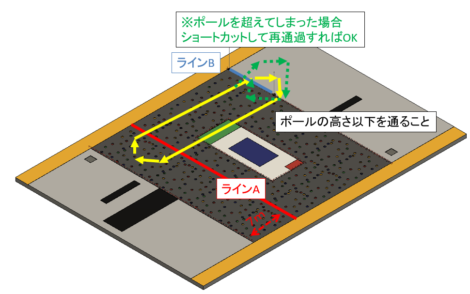  
図　ラインの定義とポール旋回の経路

### 12.宙返り  
#### 	成功条件  
		・機動面が地面に対して十分に垂直な宙返りを行うこと  
#### 	失敗条件  
		・次のミッションがコールされること  
#### 	点数  
・上下方向に機体が1回転して宙返り開始地点に戻ってきたら1回転成功したとみなし、宙返り回数に応じて加点される。  
・「宙返り点」= 宙返り回数×100  
#### 付記  
		・連続しての宙返り(各宙返りの間に１秒以上の水平飛行が行われない)は認めない。  
		・予選と決勝の宙返り回数の上限はともに3回とする。

### 13.無動力滑空  
#### 	成功条件  
		・10秒以上の滑空飛行を行うこと  
#### 	失敗条件  
		・次のミッションがコールされること  
		・「パワーオン」のコールの前に機体が接地すること  
#### 	点数  
・滑空時間を操縦者の「パワーオフ」のコールから「パワーオン」までのコールの時間とする。
　ただし、滑空時間の上限は25秒とする。  
・「無動力滑空点」=150+50×(滑空時間−10)  
#### ミッションのプロセス  
		1)操縦者の「パワーオフ」のコールで動力による推進無しの状態とする。  
		2)操舵のみを行ってミッションエリア内で滑空飛行させる。  
		3)適当なタイミングで「パワーオン」をコールし、動力による推進を開始する。  
#### 付記  
		・飛行船の沈降は滑空と見なさない。  
   
### 14.投下救援物資回収  
#### 	成功条件  
		・他のミッションで物資投下エリアに投下した救援物資のうち1つ以上を、機体に手を触れない状態で回収して離陸し、
		　離着陸エリアに着陸静止すること。機体が着陸静止した際に救援物資が離着陸エリア内にあれば、
		　着陸の衝撃等で外れてしまっても成功とみなす。  
#### 	失敗条件  
		・次のミッションがコールされること  
・物資投下エリアの救援物資がなくなること

#### 	点数  
	「物資回収離陸点」＝ 400  
	「物資回収帰還点」＝ 400

救援物資を2つ以上回収した場合、「物資回収追加点」として200点が加点される。  
	「物資回収追加点」＝ 200

#### ミッションのプロセス  
		1)操縦者の「物資回収」のコールのあと、機体を物資投下エリア 内に着陸静止させる。  
		2)物資投下エリア内を自走し、メインミッションにて投下した救援物資のうち1つを回収する。  
		3)物資投下エリア内で機体を離陸させる。この離陸のみ「離陸」項の適用を受けない。
		　物資を保持した状態で離陸に成功した場合、「物資回収離陸点」が加点される。  
		4)回収した物資を保持したまま、離着陸エリアに機体を着陸静止させる。 
		　静止した時点で「物資回収帰還点」が加点される。  
#### 	付記  
		・物資投下エリア内に着陸した機体が離陸不能となった場合、「機体回収」が認められる。
		　回収後は「離陸」項に従って離陸しプロセス1から再度挑戦することができる。  
		・操縦者と補助者は救援物資に触れることはできない。誤って救援物資を動かした場合、
		　審判によって元の位置に戻される。  
		・回収物資を搭載したままの「帰還」（離着陸エリア①に限る）を認める。この場合は「帰還」のコールを行うこと。  
		・本ミッションによって物資投下エリアに存在する救援物資の数が3個未満になった場合、
		　「10.救援物資運搬」における成功条件を満たさない。
		　すなわち、「10.救援物資運搬」の着陸と本ミッションの着陸を同時に行う場合は、
		　物資投下エリアに4個以上救援物資を投下する必要がある。

### 15.高所物資回収  
#### 成功条件  
		・競技開始前、図に示す箇所（後日追って告知する。扇風機の上を検討中）に設置された台の上に救援物資を置いても良い。
		　この救援物資を機体に手を触れない状態で回収すること。回収後、離着陸エリアに着陸することで追加点が加算される。
		　機体が着陸静止した際に救援物資が離着陸エリア内にあれば、着陸の衝撃等で外れてしまっても成功とみなす。  
#### 	失敗条件  
		・次のミッションがコールされること  
#### 点数  
台上の救援物資を落下させた場合  
		「高所物資回収点」＝ 400

回収した救援物資を保持したまま離着陸エリアに着陸静止した場合、「高所物資回収点」に加えて  
		「高所物資回収追加点」＝ 600

#### ミッションのプロセス  
		1)競技開始前、図に示された高さ1mの台に救援物資を一つ設置することができる。  
		2)操縦者の「救援物資回収」のコールのあと、飛行状態で台上の救援物資の回収を試みる。  
		3)機体の影響によって台上の救援物資を落下させた場合は「高所物資回収点」として400点が加算される。  
		4)回収した救援物資を保持したまま離着陸エリアに着陸静止した場合は、上記の「高所物資回収点」に加えて
		　「高所物資回収追加点」として600点が加算される。  
#### 	付記  
		・設置する救援物資には回収を補助する機器を取り付けることができる。
		　台上に設置することができれば、重量・サイズは問わない。また、補助具に対する有線・無線操作は禁止する。  
		・地上を走行することによって台を揺らして救援物資を落下させた場合には、成功とは見做さない。

### 16.帰還  
・ミッションを完了した機体は「帰還」を行うことができ、「帰還」によって飛行競技終了となる。  
・帰還する際には「帰還」のコールをすること。  
・ミッションエリアから離着陸エリア①に接地して機体が完全に静止した時点で帰還したとみなす｡  
・離着陸エリア①の滑走路面以外に接触せず、着陸静止できた場合は「着陸点」として300点が与えられる｡  
・機体の着陸判定については、「回収物資を除く機体の全搭載物のうち、接地している物の場所」を基準とする。  
・最大総飛行時間内に離着陸エリア①に戻ることができない場合は「未帰還」とする｡  
   
### 17.飛行時間・時間点  
・飛行開始の合図と共に計測を開始し、帰還し完全に静止した時点で計測を終了する。計測できた時間を「総飛行時間」とする。計時は1秒未満を切り捨てる。  
・「帰還」した機体については、以下の計算式により計算される。「時間点」が加算される上限は300点とする。  
　「時間点」=(標準飛行時間−総飛行時間)×5  
　（標準時間よりも総飛行時間が長い場合には「時間点」は負となる。）  
・予選の「標準飛行時間」は2分、最大総飛行時間は2分30秒とする。  
・決勝の「標準飛行時間」は3分、最大総飛行時間は4分とする。  
   
### 18.順位決定  
・まず、メインミッションおよび帰還の成否により以下の区分に分ける。  
優先1) メインミッションに成功し、帰還に成功したチーム  
優先2) メインミッションに失敗し、帰還に成功したチーム  
優先3) メインミッションに成功し、帰還に失敗したチーム  
優先4) メインミッションに失敗し、帰還に失敗したチーム  
・優先度が高い順、同じ優先度内で高得点順に順位を決定する。  
・決勝に進めるのは、順位が上位のチーム、および審査員が推薦するチームとする。  
・大会の最終的な順位は、決勝の得点により決定する。  
   
 

## 4)飛行競技ルール（自動操縦部門）  
### 1.競技内容の概要  
・参加機体は離発着エリアから飛行を開始し、ミッションエリアにて以下に述べるミッションを完了したのち、離発着エリアに帰還する。  
・最大総飛行時間内に複数のミッションを行い、機体の特性および自動操縦装置の性能を評価する項目の総合点を競う。  
・飛行機タイプ、ハイブリッド機タイプ、飛行船タイプの参加を許可する。  
・参加チーム数が多い場合には予選を行う。予選は競技時間を限定する。  
   
### 2.参加機体  
・飛行競技に参加可能な機体は、機体レギュレーションに準拠し、かつ機体審査を通過した機体に限る。  
・自動操縦部門に参加できる機体は後述の自動操縦装置を搭載・設置し、さらに各タイプについて以下の条件を満たす義務がある。  
#### 1\) 飛行機タイプ・ハイブリッドタイプ  
　空虚重量が250g以下であること  
　ただし「独立した制御ユニット」が搭載されている機体は、「独立した制御ユニット」の重量を除いた空虚重量が200g以下とする  
　  
#### 2\) 飛行船タイプ  
　最大長が1.7m 以下であること  
空虚重量の制限は原則無し、明らかに過大な場合は不可とする  
   
### 3.自動操縦装置  
・ハンズオフ飛行を実施する自動操縦装置は、以下の条件全てを満たす必要がある。  
1)飛行中の機体の状態を観測するためのセンサーを機上搭載あるいは機外に設置する。  
2)センサーより得られた観測データをもとに、機体の姿勢角や位置などの現在値を計算する。  
3)観測・推定した機体の姿勢/位置に合わせて、それらの目標値を設定する。  
4)観測・推定した機体の姿勢/位置、ならびにそれらの目標値に合わせて、機体の舵あるいは推進装置を自律的に動作させ機体を操縦者の操縦なしに飛行させる。  
・自動操縦装置を搭載する予定のチームは、事前にその概要を大会事務局に提出すること。提出書類の詳細と提出期限等は別途連絡する。  
・ハンズオフ飛行へ切り替えた時に機体の向きにかかわらずレフェリーから変化が視認できる発光体(LED等)を機体に取り付けなければならない。(発光体の色および明るさ、取り付け場所は指定しない)  
   
   
### 4.ミッションの種類  
・メインミッションは競技開始時に開始され、終了しなければ他のミッションには挑戦できない。メインミッションの開始コールの必要はない。  
・サブミッションは、各サブミッションに挑戦中に他のミッションに挑戦できない。すなわち成功条件・もしくは失敗条件を満たした場合にのみ、次のミッションに挑戦できる。サブミッションは「水平旋回」「8の字飛行」「上昇旋回」「自動離着陸および自動投下」とする。  
・「救援物資運搬」は成功条件を満たせば加点される。すなわち、メインミッション終了後、いくつかのサブミッションに挑戦してから着陸してもよい。  
・「救援物資運搬」の終了後に投下された救援物資は、審判によって即座に排除される。  
   
### 5.予選と決勝におけるミッション  
・予選および決勝において、全てのミッションへの挑戦を許可する。  
・予選においてはメインミッションのギブアップを許可する。「メインミッション中断」のコールを行うことでメインミッションを終了し、その後サブミッションに挑戦できる  
・「水平旋回」「８の字飛行」のどちらかに成功することでハンズオフ飛行成功とする。ハンズオフ飛行成功のチームは、ハンズオフ飛行に成功しなかったチームより順位が優先される。  
   
### 6.ミッションの申告  
・各チームは飛行競技開始前に、実施するミッションをミッション記入用紙に記入すること。また、それぞれのミッションを実施する直前にも、確認のため再度レフェリーにコールすること。飛行時間との兼ね合いで、ミッションを省略する場合もコールすること。飛行競技中に順序を入れ替えても良い。  
   
### 7.各ミッションへの再挑戦  
・コールしたミッションに失敗した場合、同ミッションについてのみ再挑戦を許可する。  
   
### 8.救援物資  
・救援物資は、日清食品の「チキンラーメンmini」とする。  
  
図　チキンラーメンmini

・救援物資は当日参加者が準備し、搭載のために救援物資補助具などを取り付けても良いが、袋の気密性を害する加工を行ってはならない。気密性が損なわれていると判断される場合、救援物資の交換を指示する。

### 9.メインミッション  
#### 	成功条件  
		・物資投下エリアに救援物資を1つ投下すること。  
#### 	失敗条件  
		・持ち込んだ救援物資を物資投下エリア外にすべて投下すること。  
		・「メインミッション中断」のコールがされること。  
#### 付記  
		・救援物資は競技開始前に機体に2つまで搭載できる。  
		・救援物資の持ち込みは6個までとする。  
		・メインミッション終了後、救援物資運搬もしくはサブミッションに挑戦できる  
	  
### 10.救援物資運搬  
#### 	成功条件  
		・物資投下エリアに3つ救援物資が存在する状態で「投下完了」のコールの後、離着陸エリアに静止すること  
#### 	失敗条件  
		・持ち込んだ救援物資を物資投下エリア外にすべて投下すること  
#### 	点数  
・「救援物資運搬点」=35×(60-計測時間)+(追加点)  
・計測時間は競技開始から成功条件を満たすまでの時間(秒)とする。  
　ただし、計測時間が60秒を超えた場合は追加点のみ点数となる。  
・追加点は以下のように定義する  
		追加点エリア①：150点×個数  
		追加点エリア②：200点×個数  
		追加点エリア③：400点×個数  
・追加点エリア①、②、③全てにそれぞれ１個の投下が成功した場合、個別の追加点に加えて「全エリア物資投下点」750点を加点する。

#### ミッションのプロセス  
		1\) 競技開始前に機体に救援物資を2個まで搭載する。  
		2\) 競技開始とともに、離着陸エリア①の滑走路から離陸した後、物資投下エリアに救援物資を投下する。  
		3\) 投下した後の機体を回収し、救援物資を2つまで搭載し、滑走路から離陸する。
		　　 投下後の機体は回収できればよく、離着陸エリアへの静止は求めない。  
		4\) 以上1)～3)を物資投下エリアに3つ救援物資が存在するまで繰り返す。  
		5)「投下完了」のコールの後、離発着エリアに静止する。  
#### 付記  
		・本ミッションの開始コールの必要はない。  
		・本ミッションの終了は帰還と同時でもよい。  
		・本ミッションは、メインミッション終了直後に行っても、他のサブミッションを行った後に行ってもよい。
		　すなわち、メインミッション終了後、幾つかの救援物資を投下し、その後他のサブミッションを行っても、
		　最終的に成功条件を満たしていれば加点が行われる。  
		・追加点エリア③の付近に扇風機が設置され、強にて運転される。  
		・物資投下エリアに救援物資が4つ以上投下された場合、メインミッションの追加点は3つの救援物資の追加点合計が最も小さくなるように計算される。  
  
図　救援物資運搬の流れ

   
### 11.水平旋回  
#### 	成功条件  
		・ハンズオフ飛行による水平旋回を行うこと  
#### 	失敗条件  
		・次のミッションがコールされること  
#### 	点数  
・「水平旋回点」= 水平旋回回数×200 \+ 水平旋回追加点  
・高度変化の十分小さい自動操縦による1周の旋回の回数を水平旋回回数とする。最大水平旋回回数は2回とする  
・水平旋回追加点は連続して2回旋回できた場合に加点される  
・水平旋回追加点 \= 200  
#### 	付記  
		・「上昇旋回」を行う予定の場合は、旋回方向は会場にて配布されるミッション記入用紙に記入し、記入した旋回方向のみ認められる。  
		・「上昇旋回」を行う予定の場合の旋回方向は「上昇旋回」と逆方向のみ認められる  
		・飛行船の超信地旋回（旋回の中心軸が機体の内側となる)は認めない。  
  
### 12.８の字飛行  
#### 	成功条件  
		・ハンズオフ飛行による８の字飛行を行うこと。  
#### 	失敗条件  
		・次のミッションがコールされること。  
#### 	点数  
・「8の字飛行点」= 800  
・高度変化が十分に小さく、飛行軌跡が「８の字」と認められる場合に加点を行う。  
#### 	ミッションのプロセス  
		1)「8の字開始」のコールとともに、ハンズオフ飛行に切り替える。  
		2)水平旋回を1周行う。  
		3)旋回方向を切り替える。  
		4)水平旋回を1周行う。  
#### 	付記  
		・はじめの旋回の方向は問わない。  
		・2つの旋回半径が著しく異なる場合は８の字飛行と認めない。

### 13.上昇旋回  
#### 	成功条件  
・ハンズオフ飛行による上昇旋回を行うこと。  
#### 	失敗条件  
		・次のミッションがコールされること。  
#### 	点数  
		・「上昇旋回点」= 1000  
#### 	ミッションのプロセス  
		1)「上昇旋回開始」のコールとともに、ハンズオフ飛行に切り替える。  
		2)競技エリアにおけるポールの高さ(3m)以下の高度を保ったまま、ハンズオフ飛行による水平旋回を2周行う。  
		3)旋回しながら高度を上げ、ポールの高さ以上の高度に到達する。  
		4)ポールの高さ以上の高度を保ったまま、水平旋回を2周行う。  
#### 付記  
		・旋回方向は会場にて配布されるミッション記入用紙に記入し、記入した旋回方向のみ認められる。  
		・旋回方向はサブミッション「水平旋回」と逆方向のみ認められる。  
		・機体の一部でも指定された高度領域を違反したと判断された場合、上昇旋回と認めない。  
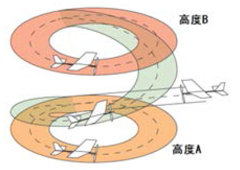

### 14.自動離着陸および自動投下  
#### 	成功条件  
		・自動操縦モードで離着陸エリア②から自動離陸した機体が、離着陸エリア①内の自動着陸用滑走路内に接地し離着陸エリア①内で静止すること  
		・自動離着陸は離着陸エリア②に帰還した後に挑戦できる  
#### 	失敗条件  
		・ミッション中止のコールがなされること  
		・競技開始後、送信機に手を触れること  
		・着陸時の接地点が自動着陸用滑走路外であること  
		・着陸時の静止位置が離着陸エリア①外であること  
#### 	点数  
・「自動離着陸点」= 自動離陸点+自動離陸追加点+自動投下点+自動着陸点+自動着陸追加点
・離着陸エリア②内にて自動離陸に成功した「自動離陸点」として200点を加算する。滑走路上で離陸した場合は「自動離陸追加点」としてさらに200点を加算する。  
・自動離着陸モードの中で、救援物資を物資投下エリアに投下できた場合、自動投下点として1000点を加点する。
　ただし、自動投下に挑戦するには、競技エリア内に持ち込まれた救援物資で、投下していないものが1つ以上あることが条件となる。  
・着陸時の接地点が自動着陸用滑走路内であり、離着陸エリア①内で静止できた場合、自動着陸を完了したとし、「自動着陸点」として600点を与える。  
・さらに着陸時の静止位置が自動着陸用滑走路内であるとき、自動着陸をエリア内で完了したとし、「自動着陸追加点」として600点を加える。

付記  
		・この競技中、図に示す位置に高さ3mの野球ネットが設置される。（詳細は後日追って告知する）  
		・この競技は離着陸エリア②の滑走路から開始する。ミッション開始から1分以内に離陸させること。  
		・審判の指示の後、機体が滑走路上で静止した状態で「自動離着陸開始」のコールとともに機体を自動離着陸飛行に切り替える。切り替え後、送信機から手を離す。  
		・当ミッション中は操縦者による自動離着陸飛行の終了操作(すなわち自動離着陸の終了もしくは中断)以外のいかなる操縦者・補助者の操作を禁止する。
		　(機体の操縦、マーカーやPCの操作等)  
		・ミッション中、機体及び会場の安全を担保するため、必要に応じて送信機を用いて危機回避行動を行うこと。ただし、送信機に手を触れた場合、このミッションは失敗となる。  
		・このミッションの挑戦中は、機体回収できない。  
		・自動離着陸を中断する場合「自動離着陸中断」をコールする。ここでミッションは終了となるが、終了までに獲得した「自動離陸点」「自動離陸追加点」「自動投下点」は消滅しない。  
		・誘導目的の着陸補助装置を競技エリア内に設置することを認める。  
		ただし装置に機体が接触した場合、着陸時の静止位置が自動着陸用滑走路の内外に関わらず「自動着陸追加点」は加算されない。

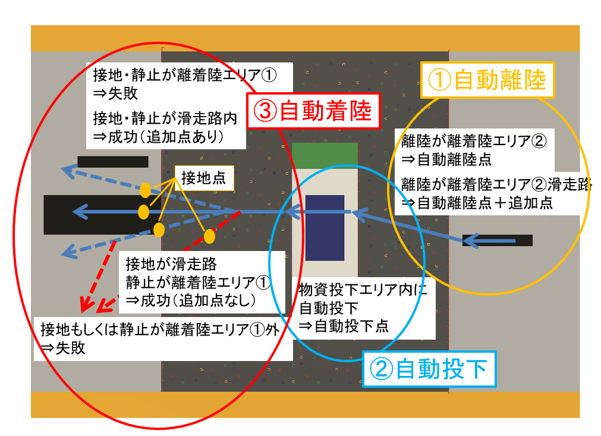  
図　自動離着陸の流れと点数区別

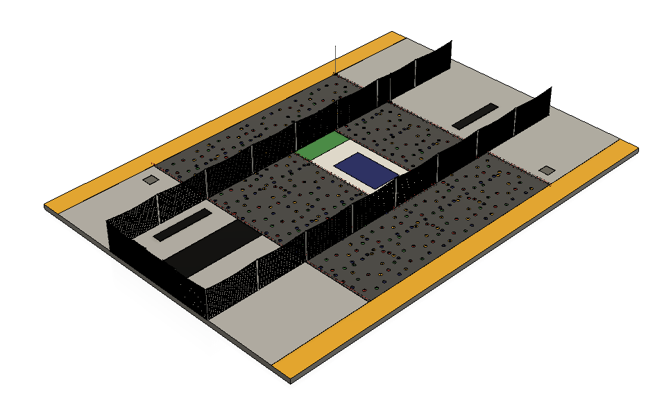  
図　野球ネットの配置  

### 15.帰還  
・ミッションを完了した機体は「帰還」を行うことができ、「帰還」によって例外を除き飛行競技終了となる。  
・帰還する際には「帰還」のコールをすること。  
・ミッションエリアから離着陸エリア①に接地して機体が完全に静止した時点で帰還したとみなす｡  
・離着陸エリア①の滑走路面以外に接触せず、着陸静止できた場合は「着陸点」として300点が与えられる｡  
・機体の着陸判定については、「機体の全搭載物のうち、接地している物の場所」を基準とする。  
・最大総飛行時間内に離着陸エリア①に戻ることができない場合は「未帰還」とする｡  
・自動離着陸ミッションに挑戦する場合は、上記の項目のうち「離着陸エリア①」を「離着陸エリア②」と読み替えて適用する。このとき、滑走路内での着陸静止が成功した場合の「着陸点」は自動離着陸の成否等に関わらず加点される。自動離着陸に失敗しても未帰還にはならない。  
   
### 16.飛行時間・時間点  
・飛行開始の合図と共に計測を開始し、帰還し完全に静止した時点で計測を終了する。計測できた時間を「総飛行時間」とする。計時は1秒未満を切り捨てる。  
・「帰還」した機体については、以下の計算式により計算される。「時間点」が加算される上限は300点とする。  
「時間点」=(標準飛行時間−総飛行時間)×5  
（標準時間よりも総飛行時間が長い場合には「時間点」は負となる。）  
・予選の「標準飛行時間」は2分、最大総飛行時間は2分30秒とする。  
・決勝の「標準飛行時間」は3分、最大総飛行時間は4分とする。  
   
### 17.順位決定  
・帰還、メインミッション、ハンズオフ飛行の成否により以下の区分に分ける。  
優先1) 帰還：成功　ハンズオフ飛行：成功　  
優先2) 帰還：成功　メインミッション：成功　ハンズオフ飛行：失敗  
優先3) 帰還：成功　メインミッション：失敗　  
優先4) 帰還：失敗　ハンズオフ飛行：成功  
優先5) 帰還：失敗　メインミッション：成功　ハンズオフ飛行：失敗　  
優先6) 帰還：失敗　メインミッション：失敗　

・優先度が高い順、同じ優先度内で高得点順に順位を決定する。  
・決勝に進めるのは、順位が上位のチーム、および審査員が推薦するチームとする。  
    
### 18.その他  
共通ルールに準ずる。

## 5)飛行競技ルール（ユニークデザイン部門）  
   
### 1.競技内容の概要  
・参加機体は、離発着エリアから飛行を開始し、ミッションエリアにてミッションを完了したのち、離発着エリアに帰還する。  
・ユニークデザイン部門では競技するミッションの指定は行わない。参加チームは行うミッションを各自で設定し、指定する方法で予め申告すること。申告された内容に従って最大総飛行時間内にミッションを行い、ミッションの有用性や達成度、機体の特性、チームによる発表について評価を行う。  
   
### 2.参加機体  
・飛行競技に参加可能な機体は、機体レギュレーションに準拠し、かつ機体審査を通過した機体に限る。  
・ユニークデザイン部門の最大重量と最大長は、室内を安全に飛行できる範囲内で任意とする。飛行動画審査等において、審査員が安全な飛行が不可能である、もしくは危険であると判断した場合には、失格・もしくは出場を許可しない場合がある。  
・マルチコプターの出場も可とする。  
   
### 3.飛行競技エリア、飛行可能空域  
・ユニークデザイン部門における飛行競技エリア、飛行可能空域については、別記飛行競技エリア・飛行可能空域に準じる。  
   
### 4.離陸  
共通ルールに準ずる。  
   
### 5.操縦  
・ユニークデザイン部門における操縦については、別記に準じるが、レフェリーの判断によって操縦者のみの該当エリア外への進入を許可する場合がある。

### 6.ミッションの種類  
・特定のミッションは課さない。出場機体は実施するミッションを各チームで設定し、制限時間内で行う。  
    
### 7.飛行中の解説  
・競技中、競技者による飛行の解説を行う必要がある。  
   
### 8.飛行時間  
・最大総飛行時間は2分と定める。  
・ 飛行時間が最大総飛行時間を超えた場合、操縦者は速やかに機体を安全な場所に着陸、停止させること。  
   
   
### 9.評価基準  
・ユニークデザイン部門では、他部門のような飛行得点による順位付けは行わない。  
・ユニークデザイン部門では、「機体の独創性や新しい概念」あるいは「行うミッションテーマの新規性および有用性」かつ「将来の航空機の発展に関わるもの」の観点から審査委員が合議して評価する。評価に際しては、「機体の製作技術や工作精度」、「機体の飛行性能」、「機体およびミッションの安全性」の観点も加味するほか、「申告したミッションが達成されたか」、「競技者による飛行中の解説」、「制限時間内に飛行を完了できたか」も評価の対象となる。評価が高かったチームに対して、「ユニークデザイン賞」を表彰する。なお、ユニークデザイン部門では将来の航空機に役立つように、安全性を担保した上で機体の大きさと重量の制限は課さない。

   
### 10.その他  
共通ルールに準ずる。

## 6)飛行競技ルール（マルチコプター部門）  
   
### 1.競技内容の概要  
・参加機体は、バーティポートから飛行を開始し、ミッションエリアにて以下のミッションを完了したのち、バーティポートに帰還する。  
   
### 2.参加機体  
・マルチコプター、ハイブリッドタイプの参加を許可する。飛行競技に参加可能な機体は、機体レギュレーションに準拠し、かつ機体審査を通過した機体に限る。  
・マルチコプター部門に参加できる機体は、さらに以下の条件をみたす義務がある。  
1\) 空虚重量が以下A,B,Cどれかの条件を満たすこと  
A）動力用モーターが4発以下：350g以下  
ただし「独立した制御ユニット」が搭載されている機体は、「独立した制御ユニット」の重量を除いた空虚重量が250g以下とする

B）動力用モーターが5発以上6発以下：390g以下  
ただし「独立した制御ユニット」が搭載されている機体は、「独立した制御ユニット」の重量を除いた空虚重量が290g以下とする

C）動力用モーターが7発以上：430g以下  
ただし「独立した制御ユニット」が搭載されている機体は、「独立した制御ユニット」の重量を除いた空虚重量が290g以下とする

ただし動力用モーターはホバリング時に十分な推力を発生させているものを指す。  
2\) 制御装置は自作であること  
　オープンソース等の利用は認めるが、競技者の機能理解度が著しく低いと判断された場合、機体審査失格とする。  
3\) 推進力(Propulsion)として２つ以上のプロペラを搭載する機体であること。ヘリコプターのサイクリックピッチ機構を持つ機体は許可しない。  
4\) 搭載する全てのプロペラ周りに安全のためにプロペラガードなどを取り付けること。  
5\) 制御回路（自動操縦回路を含む）については、事前にその概要を大会事務局に提出すること。提出書類の詳細と提出期限等は別途連絡する。  
   
### 3.ミッションの種類  
・メインミッションは競技開始時に開始され、終了しなければ他のミッションには挑戦できない。メインミッションのコールの必要はない。  
・サブミッションは、各サブミッションに挑戦中に他のミッションに挑戦できない。すなわち成功条件・もしくは失敗条件を満たした場合にのみ、次のミッションに挑戦できる。サブミッションは「大型貨物運搬」「8の字飛行」「耐故障制御」「自動離着陸」とする。  
・「高所物資運搬」は競技終了時に加点される。  
   
### 4.予選と決勝におけるミッション  
・予選および決勝において、全てのミッションへの挑戦を許可する。  
・予選においてはメインミッションのギブアップを許可する。「メインミッション中断」のコールを行うことでメインミッションを終了し、その後サブミッションに挑戦できる。  
   
### 5.ミッションの申告  
・各チームは飛行競技開始前に、実施するミッションをミッション記入用紙に記入すること。また、それぞれのミッションを実施する直前にも、確認のため再度レフェリーにコールすること。飛行時間との兼ね合いで、ミッションを省略する場合もコールすること。飛行競技中に順序を入れ替えても良い。

### 6.各ミッションへの再挑戦  
・コールしたミッションに失敗した場合、同ミッションについてのみ再挑戦を許可する。

### 7.救援物資  
・小サプライは、日清食品の「チキンラーメンmini」とする。  
  
図　チキンラーメンmini

・大サプライは日清食品の「チキンラーメン」とする。  
  
図　チキンラーメン

・大型貨物はぬいぐるみとする。
・救援物資は当日参加者が準備し、搭載のために救援物資補助具などを取り付けても良いが、袋の気密性を害する加工を行ってはならない。気密性が損なわれていると判断される場合、救援物資の交換を指示する。

### 8.メインミッション  
#### 	成功条件  
		・物資投下エリアに救援物資を1つ投下すること。  
#### 	失敗条件  
		・持ち込んだ救援物資をすべて投下すること。  
		・「メインミッション中断」のコールがされること。（予選のみ）  
#### 付記  
		・救援物資の持ち込みは4個までとする。  
		・メインミッション終了後、高所物資運搬もしくはサブミッションに挑戦できる。

### 9.高所物資運搬  
#### 	成功条件  
		・2つの高所運搬台のうち、正解の台に対して救援物資もしくは救援物資（大）を一つ以上輸送すること  
#### 	失敗条件  
		・持ち込んだ救援物資及び救援物資(大)を物資投下エリア外にすべて投下すること。  
#### 点数  
・競技終了時に正解の高所運搬台に入っているチキンラーメンミニ、チキンラーメンの数によって点数が加点される。  
・大サプライについては機体を用いて釣り上げることができれば「チキンラーメン回収成功」として400点が加算される。  
「高所物資運搬点」=400+200×(チキンラーメンミニ個数)+400(チキンラーメン回収成功)+400×(チキンラーメン個数)  
#### 付記  
		・各台の中には図に示すような識別用の紙が入っており、正解の台は競技ごとにランダムに決定される。
		　このとき正解の台を特定する方法は問わない。  
		・識別用の紙の模様は、正解のものが直径100mmの赤色(R:255 G:0 B:0)の円、
		　不正解のものは一辺100mmの青色(R:0 G:0 B:255)の正方形とする。  
		・また台の中には赤外線投光器も設置され、正解の台の投光器は発光している。  
		・加点はすべての台が倒れておらず、またすべての台上部のかごが台から落ちていない場合にのみ行われる。  
		・救援物資は袋等でまとめてあってもかまわない。  
		・投下された救援物資はカゴの内部に存在するものが加点対象となる。  
		・救援物資(大)は物資投下エリアに1個まで設置することができる。また、搭載を補助する装置を取り付けることができる。
		　ただし落下した際に体育館の床を傷つけないよう配慮すること  
		・競技開始後、救援物資は操縦者もしくは補助員が取り付けることができる。
		　救援物資(大)は操縦者および補助員が取り付けることができない。

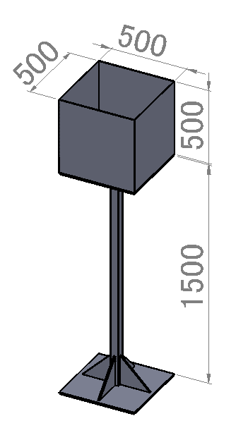  
図　高所物資輸送に使用する台  
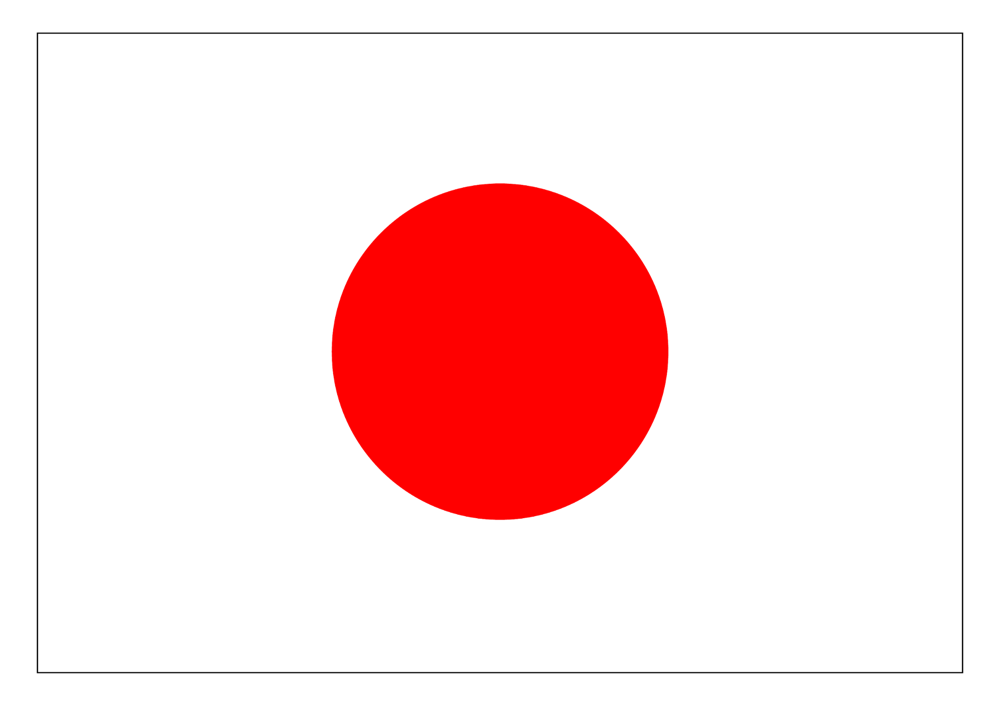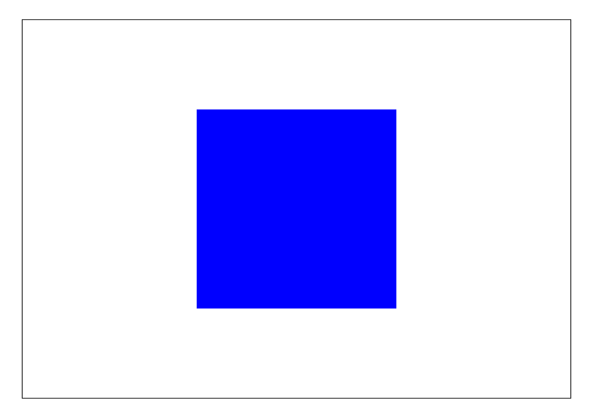  
図　識別用紙(左：正解の台　右：不正解の台)

### 10.大型貨物運搬  
#### 	成功条件  
		・離着陸エリア②の大型貨物着陸位置にぬいぐるみを静止させ、
		　糸の接続状態を保ったまま機体が離着陸エリア②のバーティポートに静止していること。  
#### 	失敗条件  
		・大型貨物が飛行競技エリア外に接地すること。  
		・ミッション挑戦中に機体もしくは大型貨物で飛行競技エリアに設置されたミニハードルを移動させること。  
		・次のミッションがコールされること  
#### 点数  
	・「大型貨物運搬点」 \= 300 「バーティポート内着陸点」 \= 400   
#### ミッションのプロセス  
		1)操縦者もしくは補助員は離着陸エリア①に設置された糸のロールから、任意の長さを切り出し、
		  会場に大型貨物設置位置に設置された大型貨物(100g程度の中型ぬいぐるみ）とマルチコプターを結びつける。  
		2)機体を離着陸エリア①のバーティポートに、大型貨物を大型貨物設置位置に静止させ、操縦者は機体を離陸させる。  
		3)離着陸エリア②の大型貨物着陸位置にぬいぐるみを静止させる。  
		4)続いて糸の接続状態を保ったまま機体を、離着陸エリア②内かつ大型貨物着陸位置外に静止させる。
		  この時点で「大型貨物運搬点」が加点される。さらに機体がバーティポート内に静止できた時は「バーティポート内着陸点」が加点される。  
#### 	付記  
		・ミッションの成否にかかわらず、ミッション終了後大型貨物は切り離してよい。  
   
### 11.8の字飛行  
#### 	成功条件  
		・2本のポールを結ぶ線(ライン0)および下図に示したラインA、ラインB　を「ライン0→ラインA→ライン0→ラインB→ライン0」
		　もしくは「ラ　イン0→ラインB→ライン0→ラインA→ライン0」の順で通過すること。  
#### 	失敗条件  
		・上記の順番以外でラインを通過すること  
		・次のミッションがコールされること  
#### 	点数  
・「８の字飛行点」= 400 \+ ８の字飛行追加点  
・８の字飛行をハンズオフ飛行によって行った場合、「８の字飛行追加点」として600点が加点される。  
#### 付記  
		・ハンズオフ飛行を用いて行う場合は「ハンズオフ8の字飛行」のコールとともに、ハンズオフ飛行に切り替えること。  
		・マーカーはポールを含めてどこに設置しても良い。飛行競技エリア外の場合は事前に事務局に相談すること。

  
図  ８の字飛行におけるライン設定  
   
### 12.耐故障制御  
#### 	成功条件  
		・動力用モーターが1発以上停止した状態で4秒以上、機体が接地せずに滞空すること。
#### 	失敗条件  
		・次のミッションがコールされること  
		・ミッション中に機体が接地すること  
#### 点数  
滞空時間を操縦者の「パワーオフ」のコールから「パワーオン」のコールまでの秒数とする。ただし滞空時間の上限は8秒とする  
「耐故障制御点」=400 \+ 100×(滞空時間)

#### 特記  
		本ミッションを予選もしくは決勝で挑戦する(成否は問わない)ことを必須条件として、Li-Po 電池：3セル(最大電圧12.6V以下)の使用を認める。  
		本特記を利用してLi-Po 電池：3セルを使用する機体で出場する場合、機体審査時点から本ミッションの実現可能性について審査される。

#### 付記  
		・「パワーオフ」のコールは機体の高度が2m以下（すなわち高所物資運搬の台の高さ以下）で有効となる。  
		・停止する動力用モーターのうち1つは大会側で指定する。2つ目以降は操縦者側で任意に選択してよい。  
		・本ミッションに挑戦する可能性があるチームは、大会当日の機体審査にて申告すること。  
	  
### 13.ユニークミッション  
#### 	成功条件、失敗条件  
		後述の受理された各ユニークミッション案による  
#### 	点数  
		各ユニークミッションごとに0\~1000点の間で設定される  
	  
#### 	ミッション提案から実施までの流れ  
① 機体審査書類の提出時に、「自分で定義したミッション内容とその成功条件」をユニークミッション案として提出する(ユニークミッションを実施しないチームも提出すること)  
② 受理されたユニークミッション案に審査員が得点を0 から1000 点の間で設定する  
③ 全てのチームのユニークミッションの得点が決まった時点で、全チームのユニークミッションは公開される  
④ 決勝戦において、自分が提出したユニークミッションもしくは他チームが提出したユニークミッションを１つだけ実施することができる(実施しなくてもよい)

#### ユニークミッションの規定  
A.機体の飛行や機能によって実現される動作、動的変化であること  
B.設定された成功条件が明確で、競技中に誰が見ても成功、失敗が明らかな内容であること  
C.既存ミッションと同一または類する内容でないこと  
D.安全性や競技進行の都合から、内容や当日の実施について改善または拒否される場合がある  
	
#### 	ミッションの提出方法  
・期日までに運営から配布するフォームにミッション内容・成功条件等を記述する。期限後、運営側で点数を決定した後、大会Slackのチャンネルにおいてフォームの内容が公開される。決定された内容・点数等の議論はチャンネルのスレッドにて公開状態で行う。  
・非公開の自チームチャンネルを用いて、期日前に運営と競技することを推奨する。

### 14.自動離着陸  
#### 成功条件  
		・ハンズオフ飛行で離着陸エリア②から自動離陸した機体が、離着陸エリア①内のバーティポートに無転倒で着陸静止すること。  
		・自動離着陸は離着陸エリア②に帰還した後に挑戦できる  
#### 	失敗条件  
		・ミッション中止のコールがなされること。  
		・競技中に送信機に手を触れること。  
		・バーティポート以外の離着陸エリア①に接地・着陸静止すること。

#### 	点数  
「自動離着陸点」 \= 200(自動離陸点) \+ 1000(自動着陸点)  
・自動離陸に成功した場合、「自動離陸点」として200点が与えられる。  
・バーティポート内に転倒せずに接地および着陸静止できたと認められる場合は「自動着陸点」として1000点が与えられる｡

#### ミッションのプロセス  
		1)操縦者は機体を離着陸エリア②のバーティポートに機体を静止させる。  
		2)「自動離着陸開始」のコールとともに自動離着陸飛行に切り替え、機体を自動離陸させる。  
		3\)自自動離着陸飛行により、機体を離着陸エリア①のバーティポート内に着陸させる。
		   バーティポート内にて機体が完全停止するまで自動離着陸飛行によって行う。  
#### 付記  
		・この競技中、図に示す位置に高さ3mの野球ネットが設置される。（詳細は後日追って告知する）  
		・ミッション開始から1分以内に離陸させること。  
		・このミッションの挑戦中は、機体回収できない。  
		・当ミッション中は操縦者による自動離着陸飛行の終了操作(すなわち自動離着陸の終了もしくは中断)以外の
		  いかなる操縦者・補助者の操作を禁止する。(機体の操縦、マーカーやPCの操作等)  
		・ミッション中、機体及び会場の安全を担保するため、必要に応じて送信機を用いて危機回避行動を行うこと。
		  ただし、送信機に手を触れた場合、このミッションは失敗となる。  
		・自動離着陸を中断する場合「自動離着陸中断」をコールする。ここでミッションは終了となるが、
		  終了までに獲得した「自動離陸点」は消滅しない。  
		・誘導目的の着陸補助装置を競技エリア内に設置することを認める。

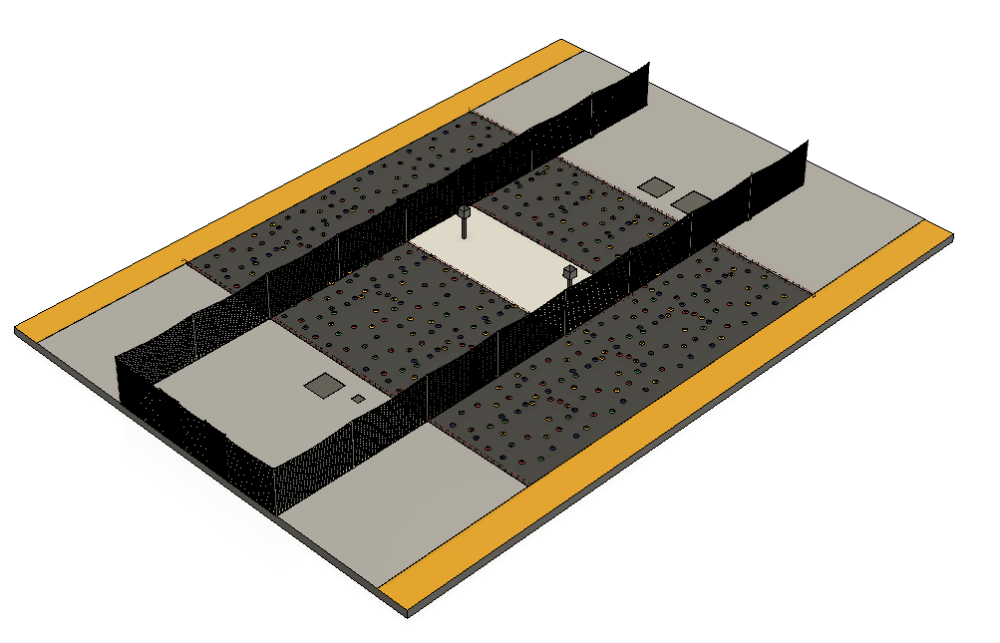  
図　野球ネットの配置

### 15.帰還  
・ミッションを完了した機体は「帰還」を行うことができ、「帰還」によって例外を除き飛行競技終了となる。  
・帰還する際、「帰還」のコールをする｡  
・ミッションエリアから離着陸エリア①内にて着陸して機体が完全に静止した時点で帰還したとみなす｡  
・バーティポート以外のどこにも接触・転倒せずに着陸静止できたと認められる場合は「着陸点」として200点が与えられる｡  
・最大総飛行時間内に離着陸エリア①内に戻ることができない場合は「未帰還」とする｡  
・機体の着陸判定については、「回収物資を除く機体の全搭載物のうち、接地している物の場所」を基準とする。  
・自動離着陸ミッションに挑戦する場合は、上記の項目のうち「離着陸エリア①」を「離着陸エリア②」と読み替えて適用する。
　このとき、バーティポート内に転倒せずに着陸静止が成功した場合の「着陸点」は自動離着陸の成否等に関わらず加点される。自動離着陸に失敗しても未帰還にはならない。

   
### 16.飛行時間・時間点  
・飛行開始の合図と共に計測を開始し、帰還し完全に静止した時点で計測を終了する。計測できた時間を「総飛行時間」とする。計時は1秒未満を切り捨てる。  
・「時間点」は以下の計算式によって計算される。時間点の上限は300点とする。  
「時間点」=(標準飛行時間−総飛行時間)×5  
・ただし、「標準飛行時間、総飛行時間」ともに（秒）で計算を行う。  
・予選の「標準飛行時間」は2分、最大総飛行時間は3分とする。  
・決勝の「標準飛行時間」は3分、最大総飛行時間は4分とする。  
   
### 17.順位決定  
・まず、メインミッションおよび帰還の成否により以下の区分に分ける  
優先1) メインミッションに成功し、帰還に成功したチーム  
優先2) メインミッションに失敗し、帰還に成功したチーム  
優先3) メインミッションに成功し、帰還に失敗したチーム  
優先4) メインミッションに失敗し、帰還に失敗したチーム  
・優先度が高い順、同じ優先度内で高得点順に順位を決定する。  
・決勝に進めるのは、順位が上位のチーム、および審査員が推薦するチームとする。  
・大会の最終的な順位は、決勝の得点により決定する。  
   
### 18.その他  
共通ルールに準ずる。  
 
